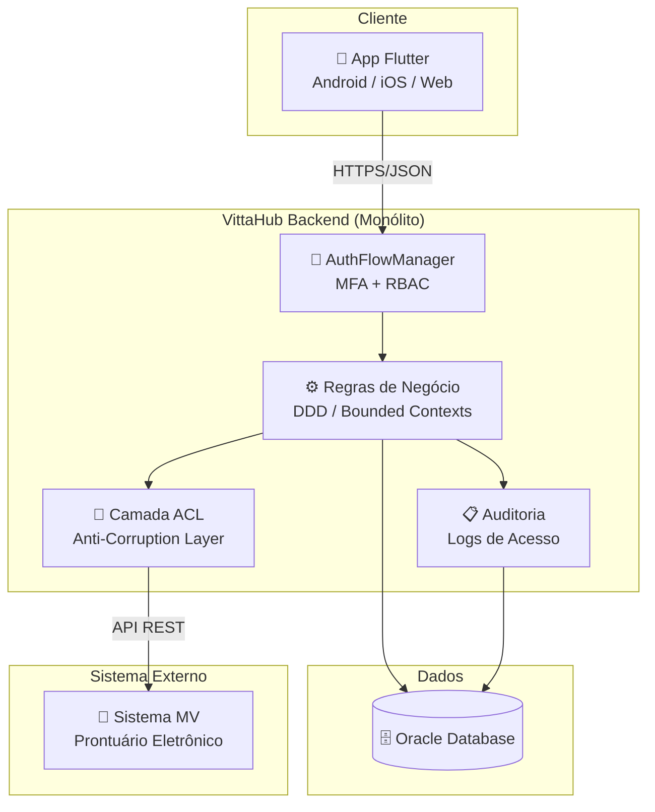

# 1. Análise Crítica da Arquitetura Atual

## 1.1 Contexto

O VittaHub foi concebido na Fase 3 do Tech Challenge como uma solução para digitalizar a comunicação de boletins médicos entre hospitais e familiares de pacientes internados. O sistema se integra ao prontuário eletrônico **MV** e disponibiliza informações resumidas de forma segura, rastreável e em conformidade com a LGPD.

Esta seção realiza uma análise honesta e fundamentada da arquitetura implementada, identificando pontos fortes, gaps e oportunidades de evolução.

---

## 1.2 Inventário da Arquitetura Real (AS-IS)

### Componentes Identificados

| Componente | Tecnologia | Responsabilidade |
|---|---|---|
| App Mobile/Web | Flutter (Dart) | Interface do responsável para visualização de boletins |
| Backend API | Dart | Regras de negócio, autenticação, autorização, auditoria |
| Camada ACL | Dart (embutida no backend) | Tradução e isolamento entre MV e VittaHub |
| Banco de Dados | Oracle | Persistência de usuários, sessões, boletins importados, logs |
| Sistema MV | Externo (API REST) | Fonte oficial do prontuário eletrônico |

### Diagrama da Arquitetura AS-IS

---

## 1.3 Pontos Fortes da Arquitetura Atual

A arquitetura definida na Fase 3 possui fundamentos sólidos que representam decisões técnicas acertadas:

### ✅ Domain-Driven Design (DDD) bem aplicado

A modelagem com **Linguagem Ubíqua**, **Bounded Contexts** e **Event Storming** demonstra maturidade na compreensão do domínio hospitalar. Os contextos delimitados identificados (MV, ACL, Backend VittaHub, App Flutter) refletem responsabilidades claras e fronteiras bem definidas.

**Por que isso importa:** O DDD não é apenas uma técnica de modelagem — ele cria as condições para que o sistema evolua sem que mudanças em uma área provoquem efeitos colaterais em outras. Essa fundação será essencial para a evolução proposta neste documento.

### ✅ Camada Anti-Corrupção (ACL) para desacoplamento do MV

A decisão de isolar o sistema legado MV por meio de uma ACL é uma das escolhas mais importantes da arquitetura. Ela garante que:

- O modelo de domínio do VittaHub não depende da estrutura interna do MV
- Mudanças na API do MV não propagam para o restante do sistema
- O VittaHub pode evoluir independentemente do ciclo de vida do prontuário eletrônico

**Por que isso importa:** Sem a ACL, qualquer alteração no MV quebraria o VittaHub. Em ambientes hospitalares, onde sistemas legados mudam em ritmos imprevisíveis, esse isolamento é uma decisão de sobrevivência técnica.

### ✅ Segurança e conformidade desde o design (Privacy by Design)

O sistema foi projetado com MFA, RBAC, criptografia AES/TLS, pseudonimização SHA-256, logs imutáveis e minimização de dados. Essas práticas estão alinhadas à LGPD Art. 46 e ISO 27001.

### ✅ Stack unificada (Dart/Flutter)

A escolha de Dart tanto para frontend quanto para backend reduz a carga cognitiva da equipe, simplifica o onboarding e permite reutilização de modelos e validações entre camadas.

---

## 1.4 Gaps e Débitos Técnicos Identificados

A análise crítica revelou pontos que necessitam de atenção para que a arquitetura sustente o crescimento do produto:

### ⚠️ Gap 1: Classificação arquitetural imprecisa

**Situação:** A documentação da Fase 3 descreve a arquitetura como *"baseada em microsserviços"*. No entanto, a implementação real consiste em um **backend único** em Dart, com um **banco de dados compartilhado** (Oracle) e a **ACL embutida no mesmo processo**.

**Por que é um gap:** Uma classificação imprecisa pode levar a decisões equivocadas. Se acreditamos que temos microsserviços, podemos tentar aplicar padrões de comunicação distribuída (como event bus, circuit breakers) onde não são necessários, ou negligenciar a organização interna do monólito por achar que "cada serviço cuida do seu".

**Reclassificação proposta:** A arquitetura atual é, na prática, um **Monólito Modular** — uma aplicação única, organizada internamente por módulos baseados em Bounded Contexts do DDD.

> **Nota:** Reclassificar como monólito modular **não é um retrocesso**. É a descrição técnica precisa que permite planejar uma evolução real. Muitas empresas de sucesso (como Shopify e Basecamp) operam com monólitos modulares em produção.

### ⚠️ Gap 2: Ausência de separação arquitetural em camadas formais

**Situação:** Embora o backend utilize princípios de DDD, não há documentação ou evidência de uma separação formal em camadas arquiteturais (como as propostas pela Clean Architecture, Onion ou Hexagonal). As responsabilidades de autenticação, regras de negócio, integração com MV e persistência coexistem no mesmo espaço arquitetural sem fronteiras explícitas.

**Por que é um gap:** Sem camadas formais, a tendência natural do código é que dependências se criem em direções indesejadas — por exemplo, regras de negócio que importam diretamente classes do Oracle, ou a ACL que conhece detalhes da camada de apresentação. Isso dificulta testes, manutenção e evolução.

### ⚠️ Gap 3: Observabilidade indefinida

**Situação:** A documentação da Fase 3 lista os componentes de observabilidade (Logs, Métricas, Rastreamento) com tecnologia marcada como *"Legado"*, sem definir ferramentas ou estratégias concretas.

**Por que é um gap:** Em um sistema que lida com dados sensíveis de saúde, a observabilidade não é opcional. Sem ela, incidentes de segurança podem passar despercebidos, problemas de performance degradam a experiência do familiar, e a auditoria exigida pela LGPD fica comprometida.

### ⚠️ Gap 4: Acoplamento potencial entre Bounded Contexts

**Situação:** Embora os Bounded Contexts estejam identificados (MV, ACL, Backend, App), não há descrição de **contratos formais** entre eles. A comunicação interna entre módulos pode estar ocorrendo por referências diretas a objetos, em vez de interfaces ou contratos definidos.

**Por que é um gap:** Bounded Contexts que se comunicam diretamente por objetos concretos perdem a capacidade de evoluir independentemente — que é justamente o benefício principal do DDD.

---

## 1.5 Síntese da Avaliação

| Aspecto | Status | Comentário |
|---|:---:|---|
| Modelagem de Domínio (DDD) | 🟢 | Sólida, com Linguagem Ubíqua e Event Storming |
| Desacoplamento do MV (ACL) | 🟢 | Decisão estratégica bem fundamentada |
| Segurança e LGPD | 🟢 | Privacy by Design com MFA, RBAC, criptografia |
| Stack tecnológica | 🟢 | Unificada e adequada ao estágio do produto |
| Classificação arquitetural | 🟡 | Descrita como microsserviços, é monólito modular |
| Camadas internas do backend | 🟡 | DDD presente, mas sem separação formal de camadas |
| Observabilidade | 🔴 | Indefinida — risco operacional e de compliance |
| Contratos entre módulos | 🟡 | Bounded Contexts identificados, mas sem interfaces formais |

---

## 1.6 Conclusão da Análise

A arquitetura do VittaHub possui uma **fundação técnica sólida**, especialmente no que diz respeito à modelagem de domínio e ao desacoplamento do sistema legado. Os gaps identificados não representam falhas graves, mas sim **oportunidades naturais de evolução** que a Fase 4 do Tech Challenge se propõe a endereçar.

As próximas seções deste documento propõem:

1. A **formalização do modelo arquitetural** como Monólito Modular (Seção 2)
2. A **aplicação da Clean Architecture** como padrão de organização interna (Seção 3)
3. A **atualização dos diagramas C4** refletindo a arquitetura evoluída (Seção 4)
4. O **roadmap de evolução técnica** com gatilhos para futuras mudanças (Seção 5)

> **Princípio guia:** Evoluir a arquitetura significa tomar decisões proporcionais ao estágio do produto. A maturidade técnica não se mede pela sofisticação das ferramentas, mas pela adequação das escolhas ao contexto real.

---

*Próxima seção: [02 - Decisão do Modelo Arquitetural](02-decisao-modelo-arquitetural.md)*
