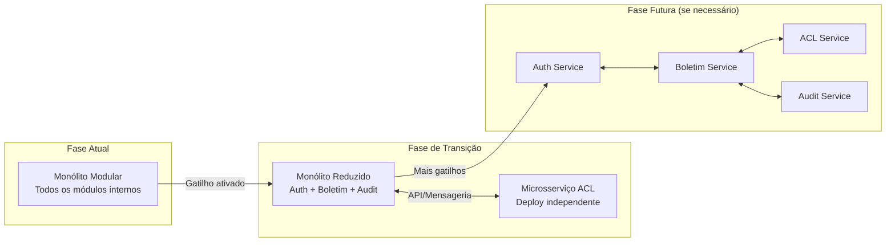

# 2. Decisão do Modelo Arquitetural

## 2.1 Objetivo

Definir e justificar o modelo arquitetural mais adequado para o VittaHub em seu estágio atual de produto, considerando maturidade da equipe, escopo funcional, requisitos regulatórios e estratégia de evolução.

---

## 2.2 Modelos Considerados

Três modelos foram avaliados conforme solicitado pelo Tech Challenge:

### Monólito Tradicional

Uma única aplicação onde todos os módulos compartilham código, banco de dados e deploy sem separação interna significativa.

```
┌─────────────────────────────────────┐
│           MONÓLITO TRADICIONAL      │
│                                     │
│  Auth + Negócio + ACL + Auditoria   │
│  (tudo misturado, sem fronteiras)   │
│                                     │
│            ┌─────────┐              │
│            │ Oracle   │              │
│            └─────────┘              │
└─────────────────────────────────────┘
```

- **Vantagem:** simplicidade máxima de deploy e operação.
- **Risco:** à medida que cresce, torna-se um "Big Ball of Mud" — código emaranhado, difícil de testar e manter.

### Microsserviços

Cada contexto de negócio é um serviço independente, com seu próprio banco de dados, deploy autônomo e comunicação via mensageria ou APIs.

```
┌──────────┐  ┌──────────┐  ┌──────────┐  ┌──────────┐
│ Auth Svc │  │Boletim Svc│  │  ACL Svc │  │Audit Svc │
│          │  │           │  │          │  │          │
│ ┌──────┐ │  │ ┌──────┐  │  │ ┌──────┐ │  │ ┌──────┐ │
│ │ DB 1 │ │  │ │ DB 2 │  │  │ │ DB 3 │ │  │ │ DB 4 │ │
│ └──────┘ │  │ └──────┘  │  │ └──────┘ │  │ └──────┘ │
└──────────┘  └───────────┘  └──────────┘  └──────────┘
      ▲              ▲              ▲              ▲
      └──────────────┴──────────────┴──────────────┘
                    Message Bus / API Gateway
```

- **Vantagem:** escalabilidade independente, deploy autônomo, isolamento de falhas.
- **Risco:** complexidade operacional enorme — requer service discovery, circuit breakers, distributed tracing, eventual consistency, orquestração de deploys. Para equipes pequenas, o custo supera o benefício.

### Monólito Modular (Modelo Escolhido ✅)

Uma única aplicação organizada internamente em **módulos bem definidos** com fronteiras claras, contratos explícitos e regra de dependência controlada. Cada módulo corresponde a um Bounded Context do DDD.

```
┌─────────────────────────────────────────────────────────┐
│                  MONÓLITO MODULAR                        │
│                                                         │
│  ┌─────────────┐  ┌─────────────┐  ┌─────────────────┐ │
│  │   Módulo     │  │   Módulo     │  │    Módulo        │ │
│  │   Auth       │  │  Boletim     │  │    Integração   │ │
│  │             │  │  Médico      │  │    MV (ACL)     │ │
│  │  interface  ◄──►  interface   ◄──►   interface     │ │
│  └─────────────┘  └─────────────┘  └─────────────────┘ │
│                                                         │
│  ┌─────────────┐                                        │
│  │   Módulo     │         ┌──────────┐                  │
│  │  Auditoria   │         │  Oracle   │                  │
│  │             │         │ (schemas  │                  │
│  │  interface  ◄────────►│ separados)│                  │
│  └─────────────┘         └──────────┘                  │
└─────────────────────────────────────────────────────────┘
```

- **Vantagem:** simplicidade operacional do monólito + organização interna preparada para evolução.
- **Risco controlado:** se as fronteiras entre módulos forem respeitadas, a migração futura para microsserviços se torna uma decisão incremental e de baixo risco.

---

## 2.3 Análise de Trade-offs

A decisão arquitetural foi tomada com base em critérios concretos, alinhados ao contexto real do VittaHub:

| Critério | Monólito Tradicional | Microsserviços | Monólito Modular |
|---|:---:|:---:|:---:|
| **Complexidade operacional** | 🟢 Baixa | 🔴 Alta | 🟢 Baixa |
| **Organização interna** | 🔴 Sem fronteiras | 🟢 Por serviço | 🟢 Por módulo |
| **Custo de infraestrutura** | 🟢 Baixo | 🔴 Alto (múltiplos deploys) | 🟢 Baixo |
| **Testabilidade** | 🟡 Depende | 🟢 Isolada por serviço | 🟢 Isolada por módulo |
| **Adequação a equipe pequena (5 devs)** | 🟢 Sim | 🔴 Não | 🟢 Sim |
| **Preparação para escalar** | 🔴 Difícil migrar | 🟢 Já escalável | 🟢 Preparado para migrar |
| **Observabilidade necessária** | 🟢 Simples | 🔴 Distributed tracing obrigatório | 🟢 Simples |
| **Alinhamento com DDD existente** | 🟡 Parcial | 🟢 Natural | 🟢 Natural |

---

## 2.4 Justificativa da Decisão

O **Monólito Modular** foi escolhido como modelo arquitetural do VittaHub pelos seguintes fundamentos:

### Fundamento 1: Proporcionalidade ao estágio do produto

O VittaHub é um MVP integrado a **um hospital parceiro**, com foco em **um domínio específico** (boletins médicos). A equipe é composta por **5 desenvolvedores**. Microsserviços resolveriam problemas que o VittaHub ainda não tem — e criariam problemas novos que a equipe não teria capacidade de gerenciar.

> **Analogia:** Comprar um caminhão para fazer entregas de bicicleta. O caminhão é poderoso, mas o custo de combustível, estacionamento e manutenção não se justifica para o volume atual de entregas.

### Fundamento 2: O DDD já criou as fronteiras certas

Os Bounded Contexts definidos na Fase 3 (Auth, Boletim, ACL/Integração MV, Auditoria) são **exatamente os módulos** do monólito modular. O trabalho de separação conceitual já foi feito — falta apenas formalizar as fronteiras no código com interfaces e contratos explícitos.

### Fundamento 3: Caminho de migração preservado

A grande vantagem do monólito modular sobre o monólito tradicional é que ele **preserva o caminho para microsserviços**. Se no futuro o VittaHub atender 50 hospitais e precisar escalar o módulo de boletins independentemente do módulo de auditoria, a extração será um processo controlado (padrão Strangler Fig), não uma reescrita.

### Fundamento 4: Referências de mercado

Empresas como **Shopify** (Ruby on Rails monólito modular), **Basecamp** (monólito modular) e **Gusto** operam sistemas de alta escala com monólitos bem organizados. A decisão de migrar para microsserviços é feita quando há evidência concreta de necessidade — não preventivamente.

---

## 2.5 Critérios de Extração Futura (Gatilhos para Microsserviços)

O monólito modular não é o destino final — é o modelo adequado para o estágio atual. A migração para microsserviços deve ser considerada quando **um ou mais** dos seguintes gatilhos se concretizarem:

| Gatilho | Indicador | Ação |
|---|---|---|
| **Escala de equipe** | Mais de 3 equipes trabalhando no mesmo repositório com conflitos frequentes de merge | Extrair módulos com mais conflitos para serviços independentes |
| **Escala de carga** | Um módulo específico (ex: ACL/MV) precisa de mais recursos computacionais que os demais | Extrair esse módulo como serviço com escalabilidade independente |
| **Ciclos de deploy divergentes** | Módulo de auditoria precisa de deploy diário, mas boletins é semanal | Separar para deploys autônomos |
| **Requisito de resiliência** | Falha na integração com MV não pode derrubar a consulta de boletins já importados | Separar ACL como serviço com circuit breaker |
| **Múltiplos hospitais com MVs diferentes** | Cada hospital tem uma versão diferente da API do MV | ACL como serviço com adapters por hospital |

### Estratégia de Migração: Strangler Fig Pattern

Quando um gatilho for ativado, a migração seguirá o padrão **Strangler Fig** — uma técnica que permite extrair módulos do monólito gradualmente, sem necessidade de reescrita completa:



> **Princípio:** A arquitetura evolui por evidência, não por especulação. Cada extração de serviço deve ser justificada por um problema concreto que o monólito modular não consegue mais resolver.

---

## 2.6 Registro Formal da Decisão (ADR-001)

Esta decisão está formalmente documentada na [ADR-001 - Adoção do Monólito Modular](adrs/ADR-001-modelo-monolito-modular.md).

---

*Seção anterior: [01 - Análise da Arquitetura Atual](01-analise-arquitetura-atual.md)*
*Próxima seção: [03 - Clean Architecture Aplicada ao VittaHub](03-clean-architecture-aplicada.md)*
