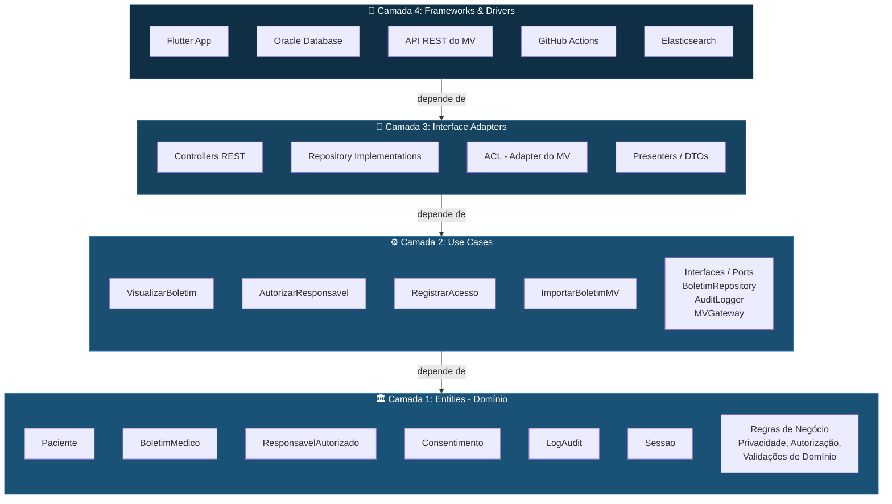
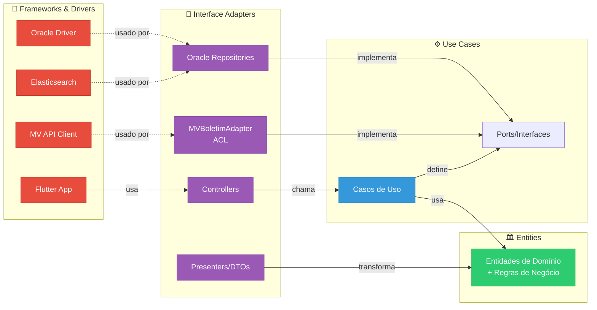

# 3. Clean Architecture Aplicada ao VittaHub

## 3.1 Por que Clean Architecture?

Na Seção 2, definimos que o VittaHub adota o modelo de **Monólito Modular**. Essa decisão responde *como os módulos se relacionam entre si*. Mas falta responder uma segunda pergunta igualmente importante: **como o código se organiza *dentro* de cada módulo?**

É aqui que entra o padrão arquitetural interno. Três opções foram avaliadas:

| Padrão | Origem | Característica Principal |
|---|---|---|
| **Hexagonal (Ports & Adapters)** | Alistair Cockburn, 2005 | Foco em portas de entrada/saída e adapters |
| **Onion Architecture** | Jeffrey Palermo, 2008 | Organização em camadas concêntricas, domínio no centro |
| **Clean Architecture** | Robert C. Martin, 2012 | Síntese das anteriores com nomenclatura clara e regra de dependência explícita |

### Decisão: Clean Architecture ✅

A Clean Architecture foi escolhida porque:

1. **É uma síntese.** Ela incorpora os melhores conceitos da Hexagonal (portas e adapters) e da Onion (camadas concêntricas), unificando-os em uma estrutura com nomenclatura clara e papéis bem definidos.

2. **Alinha-se ao DDD já existente.** As Entities da Clean Architecture correspondem diretamente aos Agregados e Entidades que o VittaHub já modelou com Event Storming. Não é necessário reescrever — apenas reorganizar.

3. **A regra de dependência protege o domínio.** Em um sistema hospitalar com dados sensíveis e requisitos regulatórios rígidos (LGPD), as regras de privacidade e auditoria devem ser **imunes** a mudanças de tecnologia. A Clean Architecture garante isso estruturalmente.

4. **Projetos de longo prazo se beneficiam da clareza.** Conforme o material da Fase 4 indica, a Clean Architecture é ideal para *"projetos com expectativa de longo prazo, mudanças tecnológicas e alta exigência de qualidade"* — que é exatamente o perfil do VittaHub.

---

## 3.2 As Quatro Camadas e a Regra de Dependência

A Clean Architecture organiza o código em quatro anéis concêntricos. A regra fundamental é:

> **Dependências de código (imports) só podem apontar de fora para dentro. Nunca o inverso.**

Isso significa que as camadas internas (Entities e Use Cases) não conhecem banco de dados, frameworks, APIs externas ou qualquer detalhe de infraestrutura. Elas definem **contratos** (interfaces) que as camadas externas implementam.



### A direção das setas é o que importa

Note que **todas as setas apontam para dentro** (em direção ao domínio). Isso significa:

- O Oracle **conhece** as Entities (para persistí-las), mas as Entities **não conhecem** o Oracle
- A ACL **conhece** os Use Cases (para fornecer dados do MV), mas os Use Cases **não conhecem** o MV
- O Flutter **conhece** os Controllers, mas os Controllers **não conhecem** o Flutter

---

## 3.3 Mapeamento: Camadas × Componentes do VittaHub

Aqui está o mapeamento concreto de cada camada para os componentes reais do VittaHub:

### 🏛️ Camada 1: Entities (Domínio)

**O que vive aqui:** As entidades de negócio e suas regras intrínsecas. Essas classes não importam nenhuma biblioteca externa, nenhum framework, nenhuma referência a banco de dados.

| Entidade | Responsabilidade | Regra de Negócio Encapsulada |
|---|---|---|
| `Paciente` | Representa o paciente internado | Validação de dados mínimos obrigatórios |
| `BoletimMedico` | Boletim resumido do paciente | Regras de visibilidade (quais campos o responsável pode ver) |
| `ResponsavelAutorizado` | Familiar com acesso autorizado | Verificação de vínculo com paciente e vigência da autorização |
| `Consentimento` | Registro de consentimento LGPD | Validação de consentimento ativo e não expirado |
| `Sessao` | Sessão autenticada do usuário | Controle de expiração e renovação |
| `LogAudit` | Registro imutável de acesso | Criação com timestamp e dados obrigatórios, sem possibilidade de alteração |

**Exemplo conceitual em Dart:**

```dart
/// Camada: Entities (Domínio)
/// Esta classe NÃO importa nenhum pacote externo.
/// Ela encapsula a regra de negócio de "quem pode ver o boletim".

class BoletimMedico {
  final String id;
  final String pacienteId;
  final String resumo;
  final DateTime dataEmissao;
  final String medicoResponsavel;
  final bool assinadoDigitalmente;

  BoletimMedico({
    required this.id,
    required this.pacienteId,
    required this.resumo,
    required this.dataEmissao,
    required this.medicoResponsavel,
    required this.assinadoDigitalmente,
  });

  /// Regra de negócio: boletim só é visível se estiver assinado
  bool estaDisponivelParaVisualizacao() {
    return assinadoDigitalmente;
  }

  /// Regra de negócio: verifica se o responsável tem autorização
  bool podeSerVisualizadoPor(ResponsavelAutorizado responsavel) {
    return responsavel.estaAutorizadoPara(pacienteId) &&
           responsavel.consentimentoAtivo() &&
           estaDisponivelParaVisualizacao();
  }
}
```

**O que aprender aqui:** Observe que o método `podeSerVisualizadoPor` encapsula uma regra de negócio complexa (autorização + consentimento + assinatura) sem saber se o responsável veio do Oracle, de um cache, ou de um mock de teste. Isso é a regra de dependência em ação.

---

### ⚙️ Camada 2: Use Cases (Casos de Uso)

**O que vive aqui:** A orquestração dos fluxos da aplicação. Cada Use Case representa uma ação que o sistema realiza — e coordena Entities, Repositories e serviços por meio de **interfaces** (contratos), nunca por implementações concretas.

| Use Case | Descrição | Interfaces que utiliza |
|---|---|---|
| `VisualizarBoletim` | Responsável solicita visualização de um boletim | `BoletimRepository`, `AuditLogger` |
| `AutorizarResponsavel` | Hospital autoriza um responsável para um paciente | `ResponsavelRepository`, `ConsentimentoRepository` |
| `RegistrarAcesso` | Registra log de auditoria de cada acesso | `AuditLogger` |
| `ImportarBoletimMV` | Importa boletim atualizado do sistema MV | `MVGateway`, `BoletimRepository` |
| `RevogarAcesso` | Remove autorização após alta hospitalar | `ResponsavelRepository`, `SessaoRepository` |

**Interfaces (contratos) definidas nesta camada:**

```dart
/// Camada: Use Cases
/// Estas interfaces são CONTRATOS. A camada de Use Cases define
/// O QUE precisa, mas não COMO é feito. A implementação fica
/// na camada de Interface Adapters ou Frameworks & Drivers.

abstract class BoletimRepository {
  Future<BoletimMedico?> buscarPorId(String id);
  Future<List<BoletimMedico>> buscarPorPaciente(String pacienteId);
  Future<void> salvar(BoletimMedico boletim);
}

abstract class MVGateway {
  /// Contrato para buscar boletim no MV — a implementação (ACL)
  /// fica na camada externa e faz a tradução de formatos.
  Future<BoletimMedico> buscarBoletimAtualizado(String pacienteId);
}

abstract class AuditLogger {
  Future<void> registrar(LogAudit log);
}
```

**Exemplo de Use Case:**

```dart
/// Camada: Use Cases
/// Este caso de uso orquestra o fluxo de visualização do boletim.
/// Note: ele depende APENAS de interfaces, não de implementações.

class VisualizarBoletim {
  final BoletimRepository _boletimRepo;
  final AuditLogger _auditLogger;

  VisualizarBoletim(this._boletimRepo, this._auditLogger);

  Future<BoletimMedico> executar({
    required String boletimId,
    required ResponsavelAutorizado responsavel,
  }) async {
    // 1. Buscar o boletim (não sabe se vem do Oracle, cache, etc.)
    final boletim = await _boletimRepo.buscarPorId(boletimId);
    if (boletim == null) {
      throw BoletimNaoEncontrado(boletimId);
    }

    // 2. Aplicar regra de negócio da Entity
    if (!boletim.podeSerVisualizadoPor(responsavel)) {
      throw AcessoNaoAutorizado(responsavel.id, boletimId);
    }

    // 3. Registrar auditoria (não sabe se vai pro Oracle, Elasticsearch, etc.)
    await _auditLogger.registrar(LogAudit.visualizacao(
      responsavelId: responsavel.id,
      boletimId: boletimId,
      timestamp: DateTime.now(),
    ));

    // 4. Retornar boletim
    return boletim;
  }
}
```

**O que aprender aqui:** O Use Case `VisualizarBoletim` orquestra o fluxo completo (buscar → validar → auditar → retornar), mas não sabe se o boletim está no Oracle ou num JSON em memória. Essa ignorância é **intencional** e é o que torna o código testável e evolutivo.

---

### 🔌 Camada 3: Interface Adapters

**O que vive aqui:** Os "tradutores" entre o mundo externo e o domínio. Aqui ficam os Controllers (que recebem requisições HTTP e chamam Use Cases), os Repository Implementations (que implementam os contratos usando Oracle), a ACL (que traduz dados do MV para o modelo do VittaHub) e os Presenters/DTOs (que formatam dados para o Flutter).

| Componente | Tipo | O que faz |
|---|---|---|
| `BoletimController` | Controller REST | Recebe requisição HTTP, chama `VisualizarBoletim`, retorna JSON |
| `OracleBoletimRepository` | Repository Implementation | Implementa `BoletimRepository` usando Oracle |
| `MVBoletimAdapter` (ACL) | Gateway Implementation | Implementa `MVGateway` traduzindo dados do MV para o domínio |
| `BoletimDTO` | Presenter/DTO | Transforma `BoletimMedico` em JSON para o Flutter |

**Exemplo — a ACL como Interface Adapter:**

```dart
/// Camada: Interface Adapters
/// A ACL implementa o contrato MVGateway, traduzindo os dados
/// do formato do MV para o modelo de domínio do VittaHub.

class MVBoletimAdapter implements MVGateway {
  final MVApiClient _mvClient; // Cliente HTTP do MV (Frameworks & Drivers)

  MVBoletimAdapter(this._mvClient);

  @override
  Future<BoletimMedico> buscarBoletimAtualizado(String pacienteId) async {
    // 1. Buscar dados no formato do MV
    final mvResponse = await _mvClient.getBoletim(pacienteId);

    // 2. TRADUZIR do modelo MV → modelo VittaHub (Anti-Corruption)
    return BoletimMedico(
      id: mvResponse['cd_boletim'].toString(),
      pacienteId: pacienteId,
      resumo: mvResponse['ds_resumo_clinico'] ?? '',
      dataEmissao: DateTime.parse(mvResponse['dt_emissao']),
      medicoResponsavel: mvResponse['nm_medico'] ?? 'Não informado',
      assinadoDigitalmente: mvResponse['sn_assinado'] == 'S',
    );
    // Note: campos como 'cd_boletim', 'ds_resumo_clinico' são do MV.
    // Se o MV mudar seus nomes, SOMENTE esta classe precisa mudar.
    // O restante do VittaHub não é afetado.
  }
}
```

**O que aprender aqui:** A ACL que vocês já tinham na Fase 3 é exatamente um **Interface Adapter** na terminologia da Clean Architecture. A diferença é que agora ela implementa um contrato (`MVGateway`) definido na camada de Use Cases, ao invés de ser chamada diretamente pelo código de negócio. Isso formaliza o que antes era uma boa prática implícita.

---

### 🔧 Camada 4: Frameworks & Drivers

**O que vive aqui:** Tudo que depende de tecnologia específica — o framework Flutter, o driver do Oracle, o cliente HTTP para o MV, o Elasticsearch para logs, o GitHub Actions para CI/CD.

| Componente | Tecnologia | Papel |
|---|---|---|
| App Flutter | Flutter/Dart | Interface do usuário multiplataforma |
| Oracle Driver | Oracle DB | Persistência de dados |
| MV API Client | HTTP/REST | Comunicação com sistema MV |
| Elasticsearch Client | Elasticsearch | Logs de auditoria e busca |
| Auth Provider | MFA/OAuth | Autenticação multifator |

**Regra:** Estas são as únicas classes que importam pacotes externos (`package:oracle`, `package:http`, `package:flutter`). Nenhuma Entity, Use Case ou Interface Adapter deve importar esses pacotes.

---

## 3.4 Estrutura de Pastas Proposta

A organização de diretórios reflete diretamente as camadas da Clean Architecture:

```
lib/
├── domain/                          # 🏛️ Camada 1: Entities
│   ├── entities/
│   │   ├── paciente.dart
│   │   ├── boletim_medico.dart
│   │   ├── responsavel_autorizado.dart
│   │   ├── consentimento.dart
│   │   ├── sessao.dart
│   │   └── log_audit.dart
│   ├── value_objects/
│   │   ├── cpf.dart
│   │   └── email.dart
│   └── exceptions/
│       ├── acesso_nao_autorizado.dart
│       └── boletim_nao_encontrado.dart
│
├── use_cases/                       # ⚙️ Camada 2: Use Cases
│   ├── visualizar_boletim.dart
│   ├── autorizar_responsavel.dart
│   ├── registrar_acesso.dart
│   ├── importar_boletim_mv.dart
│   ├── revogar_acesso.dart
│   └── ports/                       # Interfaces / Contratos
│       ├── boletim_repository.dart
│       ├── responsavel_repository.dart
│       ├── mv_gateway.dart
│       ├── audit_logger.dart
│       └── sessao_repository.dart
│
├── adapters/                        # 🔌 Camada 3: Interface Adapters
│   ├── controllers/
│   │   ├── boletim_controller.dart
│   │   ├── auth_controller.dart
│   │   └── paciente_controller.dart
│   ├── repositories/
│   │   ├── oracle_boletim_repository.dart
│   │   ├── oracle_responsavel_repository.dart
│   │   └── oracle_sessao_repository.dart
│   ├── gateways/
│   │   └── mv_boletim_adapter.dart  # A ACL vive aqui
│   └── presenters/
│       ├── boletim_dto.dart
│       └── paciente_dto.dart
│
└── infrastructure/                  # 🔧 Camada 4: Frameworks & Drivers
    ├── database/
    │   └── oracle_connection.dart
    ├── external/
    │   └── mv_api_client.dart
    ├── auth/
    │   └── mfa_provider.dart
    ├── logging/
    │   └── elasticsearch_audit_logger.dart
    └── config/
        └── app_config.dart
```

**Por que essa estrutura importa:** Se um desenvolvedor novo entrar no projeto, ele entende imediatamente onde cada tipo de código deve ficar. E mais importante: se ele tentar importar `oracle_connection.dart` dentro de `boletim_medico.dart`, a revisão de código vai identificar a violação da regra de dependência.

---

## 3.5 Diagrama de Dependências entre Camadas



**Leitura do diagrama:** As setas sólidas (→) indicam dependência de código (imports). Note que **todas apontam para dentro** — dos vermelhos (Frameworks) para os roxos (Adapters), dos roxos para os azuis (Use Cases), dos azuis para os verdes (Entities). Nenhuma seta sai do verde em direção ao vermelho.

---

## 3.6 Benefícios Concretos para o VittaHub

| Benefício | Como a Clean Architecture entrega |
|---|---|
| **Testabilidade** | Use Cases podem ser testados com mocks das interfaces, sem precisar de Oracle ou MV rodando |
| **Troca de tecnologia** | Migrar de Oracle para PostgreSQL exige alterar apenas `oracle_boletim_repository.dart`, sem tocar em regras de negócio |
| **Evolução da ACL** | Se o hospital trocar o MV por outro prontuário, ou se outro hospital usar FHIR em vez de REST, basta criar um novo adapter que implemente `MVGateway` |
| **Conformidade LGPD** | Regras de privacidade e minimização de dados ficam em Entities e Use Cases — a camada mais protegida e estável do sistema |
| **Onboarding de devs** | A estrutura de pastas deixa claro onde cada tipo de código deve ficar |
| **Preparação para microsserviços** | Cada módulo (Auth, Boletim, Auditoria) já tem fronteiras internas claras. Extrair um módulo para serviço independente significa mover pastas, não reescrever |

---

## 3.7 Registro Formal da Decisão (ADR-002)

Esta decisão está formalmente documentada na [ADR-002 - Adoção da Clean Architecture](adrs/ADR-002-clean-architecture.md).

---

*Seção anterior: [02 - Decisão do Modelo Arquitetural](02-decisao-modelo-arquitetural.md)*
*Próxima seção: [04 - Diagramas C4 Atualizados](04-diagramas-c4.md)*
