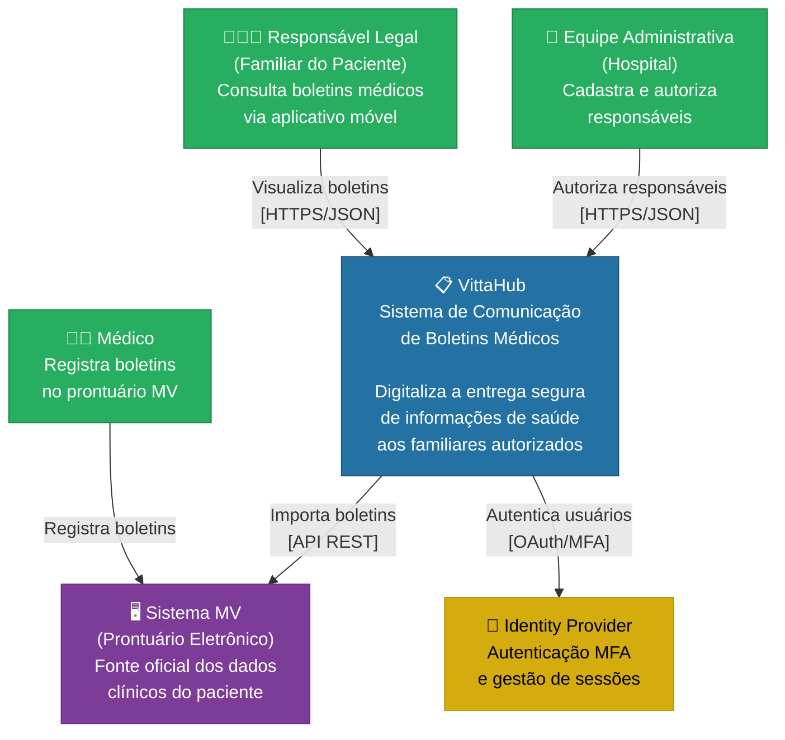
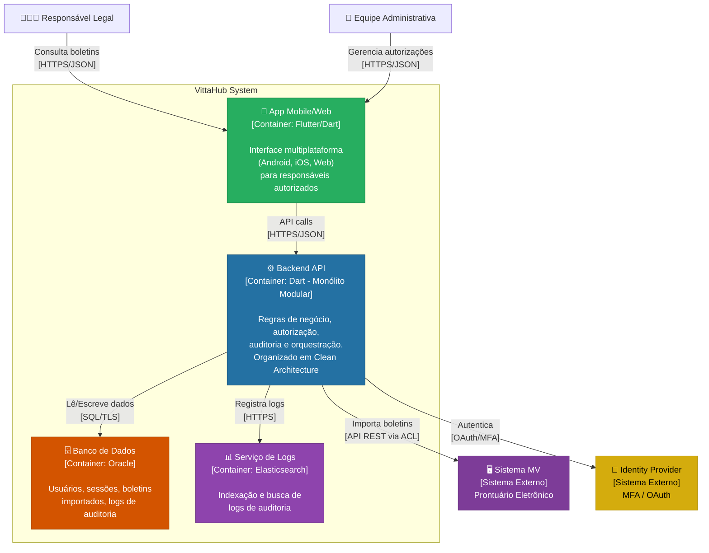

# 4. Diagramas C4 — Arquitetura Evoluída

## 4.1 Sobre o Modelo C4

O modelo C4 (Context, Container, Component, Code) é uma abordagem de documentação de arquitetura criada por Simon Brown que organiza a visualização em **níveis de zoom progressivos**. Cada nível responde a uma pergunta diferente:

| Nível | Pergunta que responde | Audiência |
|---|---|---|
| **1 — Context** | O que é o sistema e quem interage com ele? | Todos (negócio, técnico, gestão) |
| **2 — Container** | Quais são os grandes blocos técnicos? | Arquitetos e desenvolvedores |
| **3 — Component** | O que existe dentro de cada container? | Desenvolvedores e tech leads |
| **4 — Code** | Como são as classes e interfaces? | Desenvolvedores (geralmente não documentado) |

A seguir, apresentamos os diagramas atualizados nos três primeiros níveis, refletindo as decisões arquiteturais da Fase 4: reclassificação como Monólito Modular e aplicação da Clean Architecture.

---

## 4.2 Nível 1 — System Context (Diagrama de Contexto)

**Pergunta:** Qual é o ecossistema em que o VittaHub se insere?

Este diagrama mostra o VittaHub como uma "caixa preta" e identifica os atores e sistemas externos que interagem com ele. Não há detalhes técnicos — é a visão para stakeholders de negócio.



### O que este diagrama comunica

- O VittaHub é uma **camada intermediária** entre o prontuário eletrônico (MV) e os familiares
- Os médicos **não interagem diretamente** com o VittaHub — eles registram boletins no MV, e o VittaHub importa esses dados
- A autenticação é delegada a um Identity Provider externo (MFA)
- O fluxo principal é: Médico → MV → VittaHub → Responsável

---

## 4.3 Nível 2 — Container (Diagrama de Containers)

**Pergunta:** Quais são os grandes blocos técnicos que compõem o VittaHub?

Aqui fazemos zoom e abrimos a "caixa preta" para ver os containers — aplicação mobile, backend API, banco de dados, etc. Este diagrama é a ponte entre a visão de negócio e a visão técnica.



### O que mudou em relação à Fase 3

| Aspecto | Fase 3 | Fase 4 (Evoluído) |
|---|---|---|
| Classificação do Backend | "Microsserviços" | **Monólito Modular** (reflete a realidade) |
| Organização interna | DDD implícito | **Clean Architecture** explícita |
| Observabilidade | "Legado" (indefinido) | **Elasticsearch** para logs de auditoria |
| Identity Provider | Parte do backend | **Externalizado** como serviço dedicado |

---

## 4.4 Nível 3 — Component (Diagrama de Componentes do Backend)

**Pergunta:** O que existe dentro do container "Backend API"?

Este é o diagrama **mais importante** para a Fase 4, porque é onde a Clean Architecture se torna visível. Vamos abrir o backend e mostrar seus componentes internos organizados por camadas.

```mermaid
graph TB
    APP["📱 App Flutter"]
    MV["🖥️ Sistema MV"]
    DB["🗄️ Oracle"]
    ELASTIC["📊 Elasticsearch"]
    IDP["🔐 Identity Provider"]

    subgraph BACKEND["⚙️ Backend API — Monólito Modular com Clean Architecture"]

        subgraph INFRA["🔧 Frameworks & Drivers"]
            ORA_CONN["Oracle Connection<br/>[Driver de Banco]"]
            MV_CLIENT["MV API Client<br/>[HTTP Client]"]
            ES_CLIENT["Elasticsearch Client<br/>[HTTP Client]"]
            MFA_PROV["MFA Provider<br/>[Auth Client]"]
        end

        subgraph ADAPTERS["🔌 Interface Adapters"]
            CTRL_BOL["BoletimController<br/>[REST Controller]"]
            CTRL_AUTH["AuthController<br/>[REST Controller]"]
            CTRL_PAC["PacienteController<br/>[REST Controller]"]
            REPO_BOL["OracleBoletimRepo<br/>[Repository Impl]"]
            REPO_RESP["OracleResponsavelRepo<br/>[Repository Impl]"]
            ACL_MV["MVBoletimAdapter<br/>[ACL / Gateway Impl]"]
            ES_LOGGER["ElasticAuditLogger<br/>[Logger Impl]"]
        end

        subgraph USECASES["⚙️ Use Cases"]
            UC_VIS["VisualizarBoletim"]
            UC_AUT["AutorizarResponsavel"]
            UC_IMP["ImportarBoletimMV"]
            UC_REV["RevogarAcesso"]
            UC_REG["RegistrarAcesso"]
            PORTS["Ports / Interfaces<br/>BoletimRepository<br/>ResponsavelRepository<br/>MVGateway<br/>AuditLogger"]
        end

        subgraph DOMAIN["🏛️ Entities (Domínio)"]
            E_PAC["Paciente"]
            E_BOL["BoletimMedico"]
            E_RESP["ResponsavelAutorizado"]
            E_CONS["Consentimento"]
            E_LOG["LogAudit"]
            E_SESS["Sessao"]
        end
    end

    APP -->|"HTTPS/JSON"| CTRL_BOL
    APP -->|"HTTPS/JSON"| CTRL_AUTH
    APP -->|"HTTPS/JSON"| CTRL_PAC

    CTRL_BOL --> UC_VIS
    CTRL_BOL --> UC_IMP
    CTRL_AUTH --> UC_AUT
    CTRL_AUTH --> UC_REV
    
    UC_VIS --> PORTS
    UC_AUT --> PORTS
    UC_IMP --> PORTS
    UC_REV --> PORTS
    UC_REG --> PORTS

    UC_VIS --> E_BOL
    UC_AUT --> E_RESP
    UC_VIS --> E_LOG
    UC_IMP --> E_BOL

    REPO_BOL -.->|implementa| PORTS
    REPO_RESP -.->|implementa| PORTS
    ACL_MV -.->|implementa| PORTS
    ES_LOGGER -.->|implementa| PORTS

    REPO_BOL --> ORA_CONN
    REPO_RESP --> ORA_CONN
    ACL_MV --> MV_CLIENT
    ES_LOGGER --> ES_CLIENT

    ORA_CONN -->|"SQL/TLS"| DB
    MV_CLIENT -->|"REST"| MV
    ES_CLIENT -->|"HTTPS"| ELASTIC
    MFA_PROV -->|"OAuth"| IDP

    style DOMAIN fill:#1a5276,stroke:#2980b9,color:#fff
    style USECASES fill:#1b4f72,stroke:#2471a3,color:#fff
    style ADAPTERS fill:#154360,stroke:#1a5276,color:#fff
    style INFRA fill:#0e2f44,stroke:#154360,color:#fff
```



### Como ler este diagrama

1. **De cima para baixo:** O App Flutter chama os Controllers (entrada do sistema)
2. **Controllers → Use Cases:** Os controllers delegam toda a lógica para os casos de uso
3. **Use Cases → Ports:** Os casos de uso dependem de interfaces (contratos), não de implementações
4. **Use Cases → Entities:** Os casos de uso utilizam as entidades de domínio para aplicar regras de negócio
5. **Adapters → Ports (linhas pontilhadas):** As implementações concretas (Oracle, ACL, Elasticsearch) implementam os contratos definidos pelos Use Cases
6. **Adapters → Infrastructure:** As implementações usam os drivers e clients da camada de infraestrutura

**O ponto-chave:** as linhas pontilhadas (implementação de interfaces) são o mecanismo de inversão de dependência. O Use Case `VisualizarBoletim` chama `BoletimRepository.buscarPorId()` sem saber que por trás está o `OracleBoletimRepository`. Se trocarmos Oracle por PostgreSQL, apenas o adapter muda.

---

## 4.5 Visão Consolidada — Os 3 Níveis Lado a Lado

```
Nível 1 (Context)          Nível 2 (Container)         Nível 3 (Component)
─────────────────          ────────────────────         ─────────────────────
                                                        
 Responsável               📱 App Flutter               Controllers
     │                         │                            │
     ▼                         ▼                            ▼
 ┌─────────┐               ⚙️ Backend API    ──→       Use Cases + Ports
 │VittaHub │                   │                            │
 └─────────┘                   ├── 🗄️ Oracle              ▼
     │                         └── 📊 Elasticsearch     Entities (Domínio)
     ▼                                                      │
 🖥️ Sistema MV             🖥️ Sistema MV                   ▼
                                                        Adapters + Infra
                                                        (Oracle, ACL, Logs)

 "O que é?"               "Do que é feito?"           "Como funciona por
                                                        dentro?"
```

---

## 4.6 Evolução dos Diagramas em Relação à Fase 3

| Diagrama | Fase 3 | Fase 4 | Evolução |
|---|---|---|---|
| **Contexto (N1)** | Existia, mas sem Identity Provider separado | Adicionado IDP como sistema externo | Reflete externalização da autenticação |
| **Container (N2)** | Existia, backend descrito como "microsserviços" | Backend reclassificado como Monólito Modular | Descrição alinhada à realidade |
| **Componente (N3)** | **Não existia** | Adicionado com mapeamento completo das camadas Clean Architecture | **Principal contribuição da Fase 4** |
| **Observabilidade** | "Legado" | Elasticsearch definido como serviço de logs | Gap da Fase 3 endereçado |

---

*Seção anterior: [03 - Clean Architecture Aplicada ao VittaHub](03-clean-architecture-aplicada.md)*
*Próxima seção: [05 - Roadmap de Evolução Técnica](05-roadmap-evolucao.md)*
