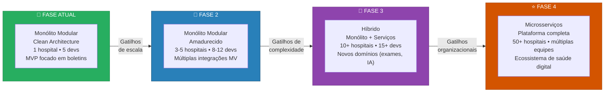
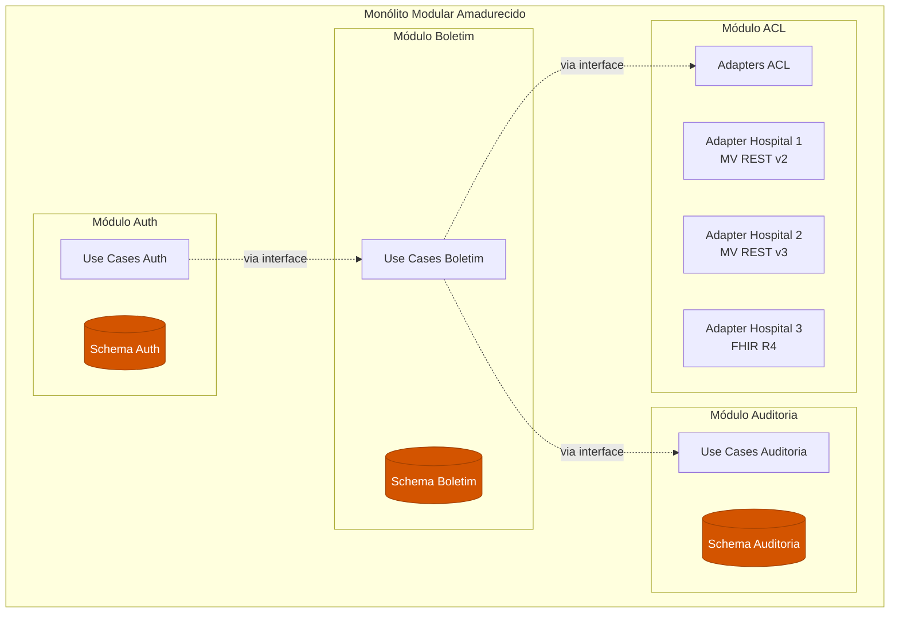
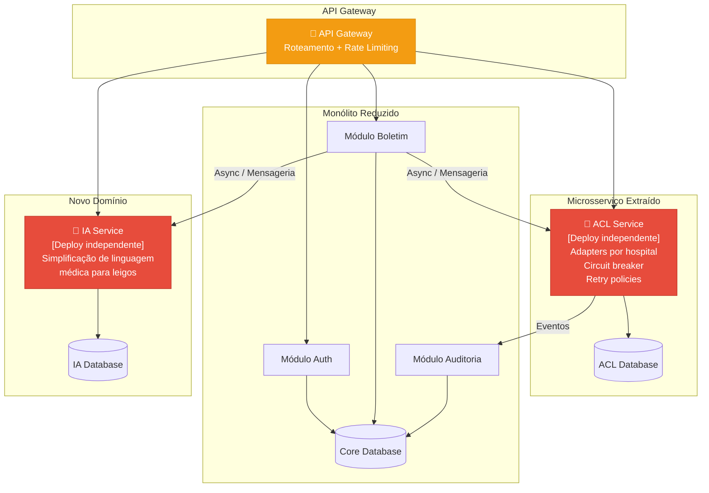
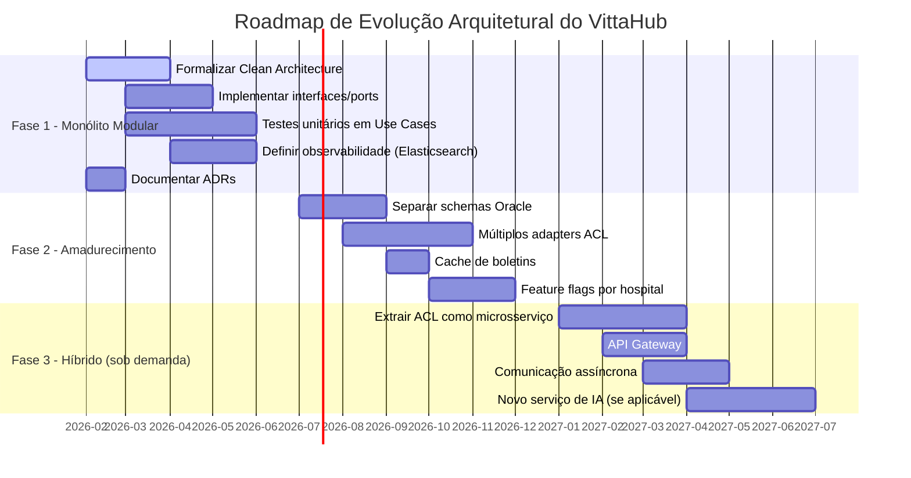

# 5. Roadmap de Evolução Técnica

## 5.1 Objetivo

Conectar as decisões arquiteturais da Fase 4 ao futuro do produto, demonstrando que as escolhas feitas (Monólito Modular + Clean Architecture) não são estáticas, mas sim a base de um plano de evolução incremental orientado por evidências.

---

## 5.2 Princípio do Roadmap

> **Evolução por evidência, não por especulação.**
>
> Cada transição de fase é ativada por **gatilhos concretos** — indicadores mensuráveis que sinalizam que a arquitetura atual não atende mais às necessidades do produto. Nenhuma mudança é feita "porque pode ser que precise".

---

## 5.3 Visão Geral das Fases de Evolução

---

## 5.4 Detalhamento de Cada Fase

### 📍 Fase 1 — Monólito Modular (ATUAL)

**Contexto:** MVP em operação com 1 hospital parceiro, equipe de 5 desenvolvedores, domínio focado exclusivamente em boletins médicos.

**Decisões arquiteturais ativas:**

| Decisão | Justificativa |
|---|---|
| Monólito Modular | Proporcional à equipe e escopo atual |
| Clean Architecture | Organização interna com regra de dependência |
| ACL para MV | Desacoplamento do sistema legado |
| Oracle compartilhado | Simplicidade operacional para MVP |
| DDD com Bounded Contexts | Fronteiras conceituais preparando evolução futura |

**Ações técnicas desta fase:**

1. **Formalizar a Clean Architecture** no código existente — reorganizar pastas conforme estrutura proposta na Seção 3
2. **Definir interfaces (ports)** para todos os pontos de integração — Repository, Gateway, Logger
3. **Implementar testes unitários** nos Use Cases usando mocks das interfaces
4. **Definir observabilidade** com Elasticsearch para logs de auditoria (endereçando o gap da Fase 3)
5. **Documentar ADRs** para cada decisão significativa

**Métricas de monitoramento:**

| Métrica | Ferramenta | Objetivo |
|---|---|---|
| Cobertura de testes nos Use Cases | SonarQube | > 80% |
| Tempo de build + deploy | GitHub Actions | < 10 minutos |
| Violações de dependência entre camadas | Análise estática / Code Review | Zero |
| Tempo de resposta da API | Prometheus/Grafana | p95 < 500ms |
| Disponibilidade | Health checks | > 99.5% |

---

### 🎯 Fase 2 — Monólito Modular Amadurecido

**Gatilhos de transição (quando sair da Fase 1):**

| Gatilho | Indicador Mensurável |
|---|---|
| Novos hospitais | 3+ hospitais parceiros, cada um com versão diferente da API do MV |
| Crescimento da equipe | 8+ desenvolvedores com conflitos frequentes de merge (> 5/semana) |
| Carga de dados | Volume de boletins importados impactando performance das queries |

**O que muda:**

**Ações técnicas desta fase:**

1. **Separar schemas no Oracle** — cada módulo passa a ter seu próprio schema, preparando a separação futura de bancos de dados
2. **Implementar múltiplos adapters de ACL** — um por hospital/versão de MV, todos implementando a mesma interface `MVGateway`
3. **Comunicação entre módulos via interfaces** — módulos não importam classes uns dos outros, apenas contratos
4. **Implementar cache de boletins** — reduzir chamadas ao MV para boletins já importados
5. **Feature flags** — habilitar funcionalidades por hospital sem deploys separados

**Por que ainda é monólito:** Mesmo com 3-5 hospitais, o deploy único simplifica operações. A separação de schemas já prepara o terreno, mas o custo de orquestrar microsserviços ainda não se justifica.

---

### 🔮 Fase 3 — Arquitetura Híbrida (Monólito + Serviços)

**Gatilhos de transição (quando sair da Fase 2):**

| Gatilho | Indicador Mensurável |
|---|---|
| Domínios divergentes | Novos módulos (exames, IA de simplificação) com requisitos técnicos muito diferentes dos boletins |
| Escala assimétrica | Módulo ACL precisa de 10x mais recursos que Auditoria |
| Resiliência | Falha na integração MV derruba funcionalidades que não dependem dela |
| Equipe | 15+ devs, necessidade de ownership por domínio |

**O que muda (Strangler Fig em ação):**

**Ações técnicas desta fase:**

1. **Extrair ACL como microsserviço** (Strangler Fig) — primeiro módulo a ser extraído porque:
   - Tem requisitos de escala diferentes (múltiplos hospitais = múltiplas chamadas externas)
   - Beneficia-se de circuit breaker e retry independentes
   - Falha na integração MV não deve derrubar consulta de boletins já importados
2. **Introduzir API Gateway** — roteamento centralizado, rate limiting, autenticação
3. **Comunicação assíncrona** — eventos entre serviços via mensageria (ex: RabbitMQ ou similar)
4. **Novo serviço de IA** — se o produto evoluir para simplificação de linguagem médica, nasce como serviço independente desde o início (não entra no monólito)

**Por que a ACL é o primeiro candidato a extração:**

A ACL é o componente com maior variabilidade (cada hospital pode ter API diferente) e maior risco de falha (depende de sistema externo). Extraí-la primeiro:
- **Isola falhas:** se o MV de um hospital cair, boletins já importados continuam acessíveis
- **Escala independente:** 50 hospitais = 50 conexões simultâneas, sem impactar o core
- **Deploy independente:** novo adapter para hospital novo sem redeployar o sistema inteiro

---

### ⭐ Fase 4 — Microsserviços (Visão de Longo Prazo)

**Gatilhos de transição (quando sair da Fase 3):**

| Gatilho | Indicador Mensurável |
|---|---|
| Múltiplas equipes | 4+ squads independentes com ownership de domínios diferentes |
| Ecossistema completo | VittaHub como plataforma (boletins + exames + IA + telemedicina + prontuário do paciente) |
| Escala regional/nacional | 50+ hospitais com SLAs diferentes |

**Esta fase é uma visão, não um plano imediato.** Sua concretização depende do crescimento real do produto e da organização. O valor de documentá-la é demonstrar que a arquitetura atual foi pensada com esse horizonte em mente.

---

## 5.5 Conexão com o Roadmap de Produto

As fases técnicas se alinham com marcos de negócio do VittaHub:

| Marco de Negócio | Fase Arquitetural | Decisão-chave |
|---|---|---|
| **MVP com hospital piloto** | Fase 1 — Monólito Modular | Validar produto com simplicidade operacional |
| **Expansão para rede hospitalar** | Fase 2 — Monólito Amadurecido | Múltiplos adapters ACL, schemas separados |
| **Novos domínios (exames, IA)** | Fase 3 — Híbrido | Extração de serviços para domínios divergentes |
| **Plataforma de saúde digital** | Fase 4 — Microsserviços | Cada domínio como produto independente |

### Timeline Estimada

> **Nota:** As datas da Fase 3 em diante são estimativas condicionais — dependem da ativação dos gatilhos descritos. Se o produto não escalar para múltiplos hospitais, a Fase 1 pode ser suficiente por anos.

---

## 5.6 Gestão de Débito Técnico

Conforme o material da Fase 4 (Aula 5 — Gerenciamento de Débito Técnico), cada decisão de "não fazer agora" gera débito técnico consciente. O roadmap gerencia esse débito de forma explícita:

| Débito Técnico | Fase em que é "pago" | Risco se não for pago |
|---|---|---|
| Observabilidade indefinida | Fase 1 (urgente) | Incidentes invisíveis, compliance LGPD comprometido |
| Banco compartilhado entre módulos | Fase 2 | Acoplamento de dados impede extração de serviços |
| Deploy único para todos os módulos | Fase 3 | Ciclos de release amarrados entre equipes |
| Comunicação síncrona entre módulos | Fase 3 | Cascata de falhas quando MV fica indisponível |

> **Princípio:** Débito técnico não é necessariamente ruim — assim como débito financeiro, pode ser uma ferramenta estratégica. O problema é débito **inconsciente** (quando nem sabemos que devemos). Este roadmap garante que todo débito é documentado, priorizado e tem um plano de pagamento.

---

*Seção anterior: [04 - Diagramas C4 Atualizados](04-diagramas-c4.md)*
*Próxima etapa: [ADRs — Architecture Decision Records](adrs/)*
